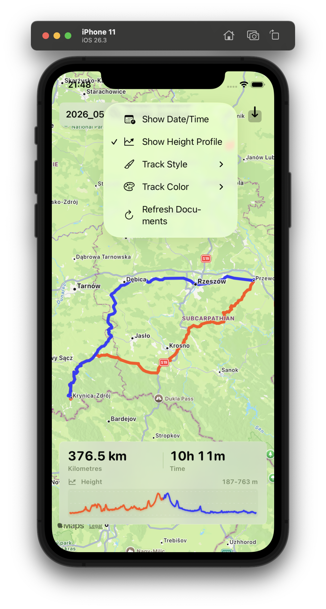

# GPX Renderer

GPX Renderer is a focused iOS app for turning GPX files into clean, shareable route maps. Open a track, see it fitted on an Apple Maps view, inspect the distance and moving time, and optionally add date/time and elevation context before saving a polished screenshot to Photos.

The app is designed for trips, rides, hikes, and any route where the shape of the journey matters. Multi-day tracks can be colored by day, single-track styling is available when you want a quieter map, and imported files stay available from the app's Documents list.

## Highlights

- Render GPX tracks on a full-screen MapKit map.
- Import `.gpx` files directly or through the iOS share extension.
- Show route distance, elapsed time, optional start date/time, and an optional height profile.
- Switch between single-color and multi-day route styling.
- Choose from several track colors.
- Save a clean map screenshot to Photos with the app controls hidden.
- Fall back to a bundled sample route when no user track has been imported yet.

## Project Structure

- `GPX-Renderer/GPX-Renderer` - SwiftUI app, GPX parsing, map rendering, statistics, and screenshot capture.
- `GPX-Renderer/GPXRendererShareExtension` - share extension for importing GPX files from other apps.
- `GPX-Renderer/Sample` - bundled sample GPX route.
- `screens` - README and project screenshots.

## Requirements

- Xcode with the iOS SDK used by the project.
- iPhone or iPad target.

Open `GPX-Renderer/GPX-Renderer.xcodeproj` in Xcode, choose the `GPX-Renderer` scheme, and run it on a simulator or device.
